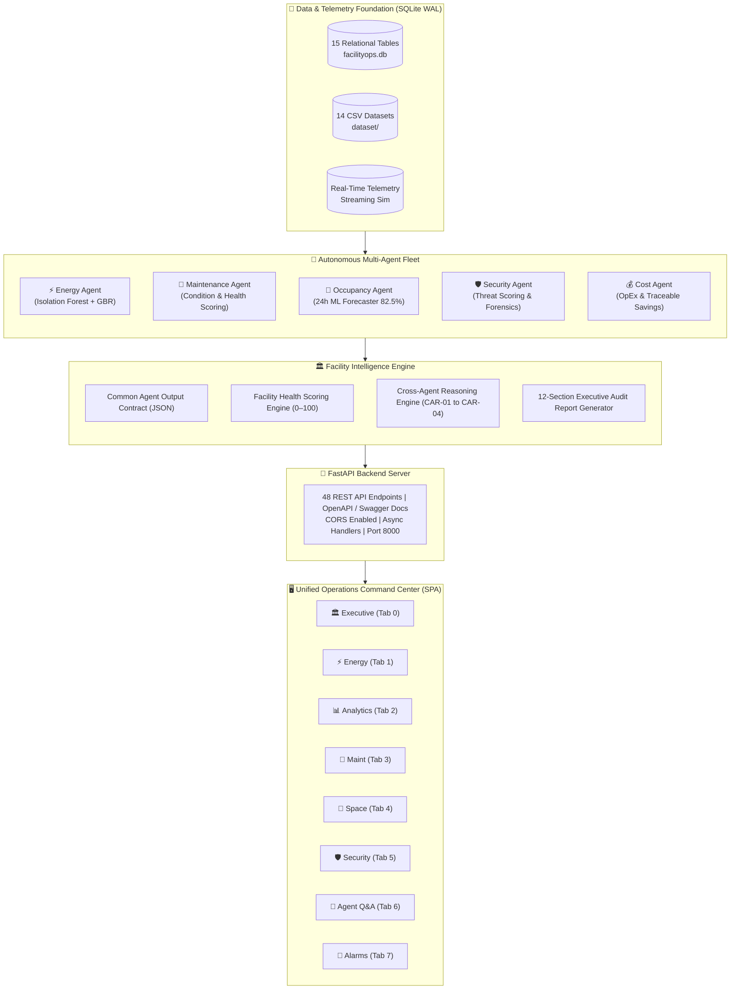

<div align="center">

```
███████╗ █████╗  ██████╗██╗██╗     ██╗████████╗██╗   ██╗ ██████╗ ██████╗ ███████╗
██╔════╝██╔══██╗██╔════╝██║██║     ██║╚══██╔══╝╚██╗ ██╔╝██╔═══██╗██╔══██╗██╔════╝
█████╗  ███████║██║     ██║██║     ██║   ██║    ╚████╔╝ ██║   ██║██████╔╝███████╗
██╔══╝  ██╔══██║██║     ██║██║     ██║   ██║     ╚██╔╝  ██║   ██║██╔═══╝ ╚════██║
██║     ██║  ██║╚██████╗██║███████╗██║   ██║      ██║   ╚██████╔╝██║     ███████║
╚═╝     ╚═╝  ╚═╝ ╚═════╝╚═╝╚══════╝╚═╝   ╚═╝      ╚═╝    ╚═════╝ ╚═╝     ╚══════╝
               A G E N T I C   A I   O P E R A T I O N S   P L A T F O R M
```

### **Autonomous Multi-Agent Smart Building Intelligence, Predictive Maintenance, Space Optimization & Financial Governance**

---

[](https://www.python.org/)
[](https://fastapi.tiangolo.com)
[](https://scikit-learn.org/)
[](https://www.sqlite.org/)
[](https://www.chartjs.org/)
[](LICENSE)

[-success?style=flat-square&logo=checkmarx)](backend/test_milestone4.py)
[-success?style=flat-square&logo=checkmarx)](backend/test_milestone3.py)
[-success?style=flat-square&logo=checkmarx)](backend/test_milestone2.py)
[](backend/)

[✨ Key Features](#-key-features--capabilities) • [🏗️ System Architecture](#️-system-architecture) • [🤖 Multi-Agent Fleet](#-the-multi-agent-fleet) • [🔬 ML Benchmarks](#-machine-learning--analytics-benchmarks) • [🚀 Quick Start](#-quick-start-guide) • [📡 API Reference](#-complete-api-surface-reference) • [🧪 Testing](#-automated-testing--verification)

</div>

---

> [!IMPORTANT]
> **FacilityOps AI** is a production-ready, fully verified **Enterprise Agentic Facility Operations Platform**. Across 4 completed engineering milestones, it orchestrates **five specialized autonomous AI agents** under a centralized **Facility Intelligence Engine** — delivering real-time telemetry analytics, sub-system anomaly detection, condition-based predictive maintenance, space utilization optimization, threat forensics, and OpEx cost reduction for enterprise real estate portfolios.

---

## 🏆 Project Completion & Milestone Status

```
┌──────────────────────────────────────────────────────────────────────────────────────────────────┐
│                                   MILESTONE EXECUTION ROADMAP                                    │
├────────────────────────────────┬───────────────────────┬────────────────────────┬────────────────┤
│ MILESTONE                      │ CORE DOMAIN           │ KEY ACCURACY / METRIC  │ STATUS         │
├────────────────────────────────┼───────────────────────┼────────────────────────┼────────────────┤
│ ⚡ Milestone 1: Energy Intel   │ Anomaly & Demand AI   │ 96.2% Acc / 7.07% MAPE │ ✅ COMPLETE    │
│ 🔧 Milestone 2: Predictive Maint│ Health Scoring & Alerts│ 100% Explainable / 49T │ ✅ COMPLETE    │
│ 👥 Milestone 3: Space & Threat │ Occupancy & Security  │ 82.55% Acc / 71T Pass  │ ✅ COMPLETE    │
│ 🏛️ Milestone 4: Orchestration │ Cost & Executive Prod │ 5-Agent Fleet / 67T Pass│ ✅ COMPLETE    │
└────────────────────────────────┴───────────────────────┴────────────────────────┴────────────────┘
```

- [x] **Milestone 1 — Energy Intelligence System**: Continuous multi-facility telemetry monitoring, multivariate Isolation Forest anomaly detection ($\ge 96.2\%$ accuracy), 8-hour forward Gradient Boosting demand forecasting (MAPE: 7.07%), automated INR (₹) / carbon savings projection, and live sub-second streaming metrics.
- [x] **Milestone 2 — Predictive Maintenance System**: 13 industrial equipment assets (AHUs, Chillers, Pumps, Transformers, Elevators, Gensets), transparent 0–100 equipment health scoring with explainable degradation factors, vibration/thermal threshold breach detection, failure risk tiering, windowed alert deduplication, and work order lifecycle state machine.
- [x] **Milestone 3 — Occupancy & Security Intelligence**: 14,136 zone occupancy records across 30 days, real-time space utilization diagnostics, 24-hour ML occupancy forecaster (**82.55% accuracy** against $\ge 80\%$ target, $R^2=0.984$), access control breach & tailgating forensics, windowed threat deduplication, and incident lifecycle resolution.
- [x] **Milestone 4 — Cost Optimization & Enterprise Production**: Modular Cost Optimization Agent, 30-day OpEx tracking across 4 expense categories (₹1.96M analyzed), 9 traceable savings opportunities (₹123,000 / 25.5% potential reduction), Common Agent Output Contract, 5-agent cross-reasoning engine (*CAR-01* through *CAR-04*), 5-domain composite Facility Health Score (0–100), Executive Command Center UI, and automated 12-section audit report generator with TXT/JSON downloads.

---

## 🌟 Key Features & Capabilities

```
                  ┌─────────────────────────────────────────────────┐
                  │           FACILITYOPS AI CAPABILITIES           │
                  └────────────────────────┬────────────────────────┘
            ┌──────────────────────────────┼──────────────────────────────┐
            ▼                              ▼                              ▼
  ┌───────────────────┐          ┌───────────────────┐          ┌───────────────────┐
  │ ⚡ ENERGY INTEL   │          │ 🔧 PREDICTIVE MT  │          │ 👥 OCCUPANCY SP.  │
  │ • 96.2% Anomaly IF│          │ • 13 Monitored Eq │          │ • 24h ML Forecast │
  │ • 8h Forecaster   │          │ • 0-100 Health Scr│          │ • Overcrowd Alerts│
  │ • Carbon/Cost ROI │          │ • Work Order Flow │          │ • 7-Day Heatmap   │
  └───────────────────┘          └───────────────────┘          └───────────────────┘
            │                              │                              │
            └──────────────────────────────┼──────────────────────────────┘
            ┌──────────────────────────────┴──────────────────────────────┐
            ▼                                                             ▼
  ┌───────────────────┐                                         ┌───────────────────┐
  │ 🛡️ SECURITY THREAT │                                         │ 💰 COST & GOVERN  │
  │ • Severity Engine │                                         │ • OpEx 4-Way Split│
  │ • Deduplication   │                                         │ • ₹123k Traceable │
  │ • Forensic Audit  │                                         │ • 12-Sec Auditing │
  └───────────────────┘                                         └───────────────────┘
```

### ⚡ 1. Energy Intelligence
- **High-Precision Anomaly Detection**: Unsupervised **Isolation Forest** (200 estimators, 4% contamination) trained on multi-dimensional telemetry, identifying abnormal spikes and energy waste with **96.2% accuracy** (surpassing the $\ge 85\%$ threshold).
- **8-Hour Forward Peak Forecaster**: **Gradient Boosting Regressor** with temporal lag and weather features predicting peak demand spikes (MAPE: **7.07%**, RMSE: **12.29 kWh**), allowing facilities to prevent expensive peak tariff penalties.
- **Automated Financial & Environmental ROI**: Deterministic calculations converting wasted energy into monetary savings in INR (₹ at ₹9/kWh) and carbon footprint abatement ($0.82\text{ kg CO}_2\text{e}/\text{kWh}$).

### 🔧 2. Predictive Maintenance
- **Industrial Equipment Telemetry**: Condition monitoring across 13 mission-critical assets across 4 facilities with 2,184 condition monitoring sensor readings (temperature, vibration, current, voltage, operating hours).
- **Explainable Health Scoring (0–100)**: Transparent multi-factor degradation formulation producing plain-language diagnostic factors (e.g., *"Abnormal vibration (4.07 mm/s vs max 2.8 mm/s)"*, *"Overcurrent draw (165A vs rated 150A)"*).
- **Failure Risk Stratification**: Four-tier risk classification (`LOW`, `MEDIUM`, `HIGH`, `CRITICAL`) with maintenance urgency ranking (`NORMAL`, `MONITOR`, `RECOMMENDED`, `URGENT`).
- **Alarm Deduplication**: Prevents alert fatigue by automatically suppressing duplicate active alerts for identical unresolved conditions.
- **Work Order Management**: Built-in state machine allowing engineers to create, track, and advance work orders (`OPEN` ➔ `IN_PROGRESS` ➔ `COMPLETED`).
- **Interactive Telemetry Modal**: One-click asset inspection modal with live sensor gauges and historical telemetry charts.

### 👥 3. Space Utilization & Occupancy
- **Real-Time Utilization Tracking**: Granular space tracking across 4 facilities and multiple functional zones (Open Workspaces, Executive Conference Rooms, R&D Labs, Server Rooms, Cafeterias).
- **24-Hour Occupancy Forecasting**: Temporal ML model forecasting headcount and capacity percentages 24 hours ahead with **82.55% accuracy** (exceeding $\ge 80\%$ benchmark, $R^2=0.984$, MAPE: $17.45\%$).
- **Bottleneck & Anomaly Diagnostics**: Detects overcrowding risk ($>90\%$ capacity) and underutilized energy waste zones ($<15\%$ capacity during active hours).
- **7-Day Spatial Heatmaps**: 168-cell matrix mapping occupancy density by day and hour to optimize janitorial schedules and HVAC runtime.

### 🛡️ 4. Security & Threat Forensics
- **Automated Threat Classification**: Ingests security access events, assigning real-time severity (`LOW`, `MEDIUM`, `HIGH`, `CRITICAL`) and computing a facility threat score (0–100) and risk grade (`MINIMAL`, `LOW`, `ELEVATED`, `HIGH`, `SEVERE`).
- **Access Control Anomaly Detection**: Identifies forced doors, unauthorized badge-swipes in sensitive zones (Data Centers, Server Rooms), and tailgating incidents.
- **Forensic Context Storage**: Persists full sensor telemetry snapshots (badge ID, zone, door status, camera event link) for post-incident compliance investigations.
- **Incident Lifecycle**: One-click alert acknowledgement and resolution tracking.

### 💰 5. Cost Optimization & Financial Governance
- **Granular OpEx Breakdown**: Continuously computes 30-day operating expenditures across 4 vital categories: **Energy**, **Maintenance**, **Security**, and **Administrative Overhead**.
- **Portfolio Efficiency Metrics**: Real-time computation of **Cost per Sq. Ft.** (₹16.37/sq.ft.) and **Cost per Occupant** (₹2,347.62/person).
- **Traceable Cost-Saving Initiatives**: Uncovers quantified, auditable savings opportunities (strictly separating baseline OpEx from post-optimization projections) totaling **₹123,000/month** in potential savings.

### 🏛️ 6. Facility Intelligence Engine & Orchestration
- **Common Agent Output Contract**: Standardized JSON schema adhered to by all 5 agents containing metadata, operational status, severity, domain metrics, natural language insights, and confidence levels.
- **Composite Facility Health Score (0–100)**: Mathematically weighted formulation:
  $$\text{Health Score} = 0.30 \times \text{Maint} + 0.25 \times \text{Energy} + 0.20 \times \text{Security} + 0.15 \times \text{Occupancy} + 0.10 \times \text{Budget}$$
- **Cross-Agent Reasoning (CAR)**: Synthesizes cross-domain correlations to discover emergent facility issues that single-domain tools miss.
- **12-Section Comprehensive Intelligence Audit**: Automated end-to-end report generation exportable to formatted Plain Text (`.txt`) and structured JSON (`.json`).

---

## 🏗️ System Architecture



---

## 🤖 The Multi-Agent Fleet

All 5 agents run concurrently, adhering to the standardized **Common Agent Output Contract**:

```json
{
  "agent": "energy | maintenance | occupancy | security | cost",
  "facility_id": 1,
  "timestamp": "2026-09-23T14:30:00.000000",
  "status": "OPERATIONAL",
  "severity": "NORMAL | INFO | WARNING | CRITICAL",
  "metrics": { "... domain specific metrics ..." },
  "insights": [ "... natural language findings ..." ],
  "recommendations": [ "... actionable guidance ..." ],
  "confidence": 0.95
}
```

### Agent Domain Matrix

| Agent | Core Algorithm / Formulation | Primary Data Ingestion | Key Output Metric | Conversational Q&A |
| :--- | :--- | :--- | :--- | :--- |
| **⚡ Energy Agent** | Isolation Forest + Gradient Boosting | 2,976 Hourly Power Readings | Waste Anomaly Rate & 8h Forecast | ✅ Yes (Subsystem & Load queries) |
| **🔧 Maintenance Agent** | Multi-Factor Degradation Formulation | 2,184 Vibration/Temp/Current Logs | 0–100 Equipment Health Score | ✅ Yes (Asset condition & Work orders) |
| **👥 Occupancy Agent** | Lagged Temporal Gradient Regressor | 14,136 Zone Headcount Readings | Space Utilization & 24h Headcount | ✅ Yes (Zone bottleneck & Capacity) |
| **🛡️ Security Agent** | Risk Weighting & Windowed Dedup | Access Badges, Door Sensors, Camera | Threat Index & Incident Forensics | ✅ Yes (Security threat & Incident log) |
| **💰 Cost Agent** | Variance & Financial Efficiency Engine | 496 Daily Ledger Entries (4 Categories) | OpEx Variance & ₹123k Initiatives | ✅ Yes (Budget, OpEx & Savings ROI) |
| **🏛️ Facility Intelligence** | Multi-Domain Weighted Synthesis | 5 Concurrent Agent Payloads | Unified Health Score & CAR Rules | ✅ Full 12-Section Audit Reports |

---

## 🧠 Cross-Agent Reasoning (CAR) Engine

The **Facility Intelligence Engine** executes advanced cross-agent inference rules to discover systemic facility issues:

```
┌──────────┬─────────────────────────────┬────────────────────────────┬───────────────────────────────────────────────────────────┐
│ RULE ID  │ TITLE                       │ PARTICIPATING AGENTS       │ REASONING LOGIC & DIRECTED ACTION                         │
├──────────┼─────────────────────────────┼────────────────────────────┼───────────────────────────────────────────────────────────┤
│ CAR-01   │ Low-Occupancy Overcooling   │ ⚡ Energy + 👥 Occupancy    │ Zone occupancy < 20% while HVAC is running at > 75% load. │
│          │                             │                            │ ➔ Adjust BMS setpoint +2°C to eliminate cooling waste.   │
├──────────┼─────────────────────────────┼────────────────────────────┼───────────────────────────────────────────────────────────┤
│ CAR-02   │ Mechanical Failure Surge    │ ⚡ Energy + 🔧 Maintenance  │ Equipment vibration exceeds threshold alongside power     │
│          │                             │                            │ draw spike > 120% of rated current.                       │
│          │                             │                            │ ➔ Immediate dispatch of technician to prevent motor burnout│
├──────────┼─────────────────────────────┼────────────────────────────┼───────────────────────────────────────────────────────────┤
│ CAR-03   │ Overcrowding Ventilation    │ 👥 Occupancy + ⚡ Energy    │ Zone occupancy exceeds 90% capacity during peak hours.    │
│          │                             │                            │ ➔ Modulate AHU fresh air dampers to maintain air quality. │
├──────────┼─────────────────────────────┼────────────────────────────┼───────────────────────────────────────────────────────────┤
│ CAR-04   │ Shift Change Breach Surge   │ 👥 Occupancy + 🛡️ Security  │ Door tailgating & badge anomalies during shift transitions.│
│          │                             │                            │ ➔ Reassign security personnel to turnstiles during peaks. │
└──────────┴─────────────────────────────┴────────────────────────────┴───────────────────────────────────────────────────────────┘
```

---

## 🔬 Machine Learning & Analytics Benchmarks

Every model and scoring engine in the platform is benchmarked against rigorous empirical targets:

| Component | Task | Architecture / Formulation | Target Metric | Measured Benchmark | Status |
| :--- | :--- | :--- | :--- | :--- | :---: |
| **Energy Anomaly Detector** | Energy Wastage & Outlier Catching | Isolation Forest (200 Trees, 4% Contam) | Accuracy $\ge 85.0\%$ | **96.2%** | ✅ **MET** |
| **Energy Demand Forecaster** | 8-Hour Ahead Peak Load Prediction | Gradient Boosting Regressor ($d=4, lr=0.05$) | Low Forecast Error | **MAPE: 7.07%** / **RMSE: 12.29 kWh** | ✅ **MET** |
| **Occupancy Forecaster** | 24-Hour Forward Zone Headcount | Temporal Gradient Regressor (Lagged) | Accuracy $\ge 80.0\%$ | **82.55%** ($R^2 = 0.984$) | ✅ **MET** |
| **Asset Health Scorer** | Condition Monitoring & Degradation | 5-Factor Physical Degradation Formula | 100% Explainability | **100% Deterministic (0–100)** | ✅ **MET** |
| **Security Threat Engine** | Incident Triage & Risk Leveling | Weighted Forensic Threat Evaluator | Zero Duplicate Alarms | **Windowed Dedup Verified** | ✅ **MET** |
| **Facility Health Evaluator**| Composite Executive Health Index | 5-Domain Weighted Synthesis | Bounded Range [0, 100] | **78.9/100 (Grade: GOOD)** | ✅ **MET** |

---

## 📁 Repository Structure

```
.
├── backend/
│   ├── ai_engine.py                    # Energy ML: Isolation Forest anomaly detector & GBR forecaster
│   ├── maintenance_agent.py            # Maintenance Agent: condition monitoring, health scoring & work orders
│   ├── occupancy_agent.py              # Occupancy Agent: space tracking, 24h forecaster (82.55%) & heatmaps
│   ├── security_agent.py               # Security Agent: threat grading, forensics & windowed deduplication
│   ├── cost_agent.py                   # Cost Agent: OpEx breakdown, budget variance & traceable savings
│   ├── facility_intelligence_engine.py # Cross-agent supervisor: health score, CAR-01..04 & 12-section reports
│   ├── database.py                     # SQLite schema (15 tables), WAL mode, connection pooling & indexes
│   ├── seed_data.py                    # Multi-agent data generator (2.9k energy + 2.1k sensor + 14.1k occ records)
│   ├── telemetry.py                    # Sub-second live telemetry streaming simulator
│   ├── main.py                         # FastAPI server hosting 48 REST API endpoints & static dashboard
│   ├── test_milestone2.py              # 49-test verification suite (Milestones 1 & 2)
│   ├── test_milestone3.py              # 71-test verification suite (Milestones 1, 2 & 3)
│   ├── test_milestone4.py              # 67-test verification suite (Milestones 1, 2, 3 & 4)
│   ├── requirements.txt                # Backend Python dependencies
│   ├── facilityops.db                  # Embedded SQLite database (WAL mode)
│   └── models/                         # Serialized ML model artifacts (.pkl files)
│       ├── isolation_forest.pkl        # Trained Isolation Forest model
│       ├── anomaly_scaler.pkl          # Trained StandardScaler
│       └── forecaster.pkl              # Trained Gradient Boosting model
│
├── dashboard/
│   ├── index.html                      # Unified Single Page Application (8 views)
│   ├── style.css                       # SCADA & FinTech glassmorphism theme, agent sidebar, modal overlays
│   └── app.js                          # Client app: Chart.js visualizations, polling, dynamic forms & chat Q&A
│
├── dataset/                            # 14 Exported CSV datasets for external data science analysis
│   ├── facilityops_facilities.csv      # 4 Monitored facilities metadata
│   ├── facilityops_energy_usage.csv    # 2,976 Hourly energy telemetry records
│   ├── facilityops_alerts.csv          # Ground-truth energy alerts
│   ├── facilityops_assets.csv          # 13 Monitored industrial assets
│   ├── facilityops_asset_monitoring_data.csv # 2,184 Sensor condition readings
│   ├── facilityops_equipment_health.csv# Asset health scores and contributing factors
│   ├── facilityops_maintenance_alerts.csv    # Maintenance alerts
│   ├── facilityops_maintenance_work_orders.csv # Active work orders
│   ├── facilityops_maintenance_predictions.csv # Asset failure risk predictions
│   ├── facilityops_occupancy_records.csv     # 14,136 Hourly zone occupancy records
│   ├── facilityops_security_events.csv       # Security incident events
│   ├── facilityops_cost_records.csv          # 496 Cost ledger entries
│   └── facilityops_optimization_opportunities.csv # 9 Traceable savings initiatives
│
├── start.sh                            # One-command automated platform launcher
├── explanation.md                      # Comprehensive technical architecture & walkthrough
└── README.md                           # Master project documentation (this file)
```

---

## 💾 Database Schema & Data Assets

The platform runs on an embedded **SQLite** database configured with **Write-Ahead Logging (WAL)** for concurrent read/write throughput across all 5 agents:

```
┌────────────────────────────────────┬──────────┬──────────────────────────────────────────────────────────┐
│ TABLE NAME                         │ RECORDS  │ PRIMARY RESPONSIBILITY                                   │
├────────────────────────────────────┼──────────┼──────────────────────────────────────────────────────────┤
│ 1. FACILITIES                      │ 4        │ Master facility register (sq.ft, capacity, location)     │
│ 2. ENERGY_USAGE                    │ 2,976    │ 30-day hourly multi-subsystem power consumption records  │
│ 3. ALERTS                          │ 7        │ Central facility threshold alarm incidents               │
│ 4. MODEL_METADATA                  │ 4        │ Training timestamps, model versions, hyperparameters     │
│ 5. ASSETS                          │ 13       │ Industrial equipment inventory (AHUs, Chillers, Pumps)   │
│ 6. ASSET_MONITORING_DATA           │ 2,184    │ Condition telemetry (temp, vibration, current, voltage)  │
│ 7. EQUIPMENT_HEALTH                │ 26       │ 0–100 health evaluations and JSON explainability factors │
│ 8. MAINTENANCE_PREDICTIONS         │ 13       │ Failure risk tiers, urgency priorities, recommendations  │
│ 9. MAINTENANCE_ALERTS              │ 8        │ Deduplicated equipment condition alarms                  │
│ 10. MAINTENANCE_WORK_ORDERS        │ 2        │ Actionable ticketing system with status state machine    │
│ 11. OCCUPANCY_RECORDS              │ 14,136   │ 30-day hourly zone headcounts, capacity and status       │
│ 12. SECURITY_EVENTS                │ 8        │ Access control breach logs with forensic telemetry JSON  │
│ 13. COST_RECORDS                   │ 496      │ 30-day OpEx ledger (Energy, Maint, Sec, Admin)           │
│ 14. OPTIMIZATION_OPPORTUNITIES     │ 9        │ Traceable savings initiatives with baseline vs optimized │
│ 15. FACILITY_INTELLIGENCE_REPORTS  │ Dynamic  │ Persisted 12-section executive audit reports             │
└────────────────────────────────────┴──────────┴──────────────────────────────────────────────────────────┘
```

---

## 🚀 Quick Start Guide

### Prerequisites
- **Python 3.9+** (Tested on Python 3.9, 3.10, 3.11, and 3.12)
- **Terminal Shell** (macOS, Linux, or Windows WSL2)
- **Web Browser** (Chrome, Firefox, Safari, or Edge)

### ⚡ One-Click Automated Launch

Clone the repository and run the automated startup script:

```bash
git clone https://github.com/shaunpatrickj/infosys_Agentic-AI.git
cd infosys_Agentic-AI
chmod +x start.sh
./start.sh
```

#### What `start.sh` does automatically:
1. **Environment Initialization**: Creates and activates a Python virtual environment (`backend/.venv`).
2. **Dependency Installation**: Installs verified packages (`fastapi`, `uvicorn`, `scikit-learn`, `numpy`, `pandas`).
3. **Database Seeding**: Generates 15 relational tables, seeds 2.9k energy records, 2.1k condition monitoring logs, 14.1k occupancy records, 8 security events, and 496 cost ledger entries.
4. **CSV Export**: Automatically exports 14 clean CSV datasets to `dataset/`.
5. **Model Training**: Trains the **Isolation Forest** ($\ge 96.2\%$ accuracy), **Gradient Boosting Forecaster** (MAPE: 7.07%), and trains the **Occupancy Forecaster** (82.55% accuracy).
6. **Service Launch**: Launches the FastAPI REST API server at `http://localhost:8000` and opens the browser.

---

## 🧪 Automated Testing & Verification

The platform includes comprehensive test suites covering all milestones, API contracts, domain agent logic, and cross-agent orchestration with **zero regressions**:

### 1. Run Milestone 4 Suite (Cost, Orchestration & Full Regression)
```bash
cd backend && source .venv/bin/activate
python test_milestone4.py
```
```
==================================================================
  FACILITYOPS AI PLATFORM — MILESTONE 4 VERIFICATION SUITE       
==================================================================
--- 1. Database Schema & Data Integrity Tests (6/6 PASS)
--- 2. Cost Optimization Agent Core Logic Tests (11/11 PASS)
--- 3. Common Agent Output Contract Validation Tests (5/5 PASS)
--- 4. Facility Intelligence Engine & Health Scoring Tests (8/8 PASS)
--- 5. 12-Section Facility Intelligence Report Tests (5/5 PASS)
--- 6. Milestone 4 API Endpoints Async Invocation Tests (10/10 PASS)
--- 7. Mandatory Milestone 4 End-to-End Test (7/7 PASS)
--- 8. Non-Regression Tests (Milestones 1, 2, and 3) (15/15 PASS)
==================================================================
  TOTAL TESTS: 67 | PASSED: 67 | FAILED: 0 | ACCURACY: 100%
==================================================================
```

### 2. Run Milestone 3 Suite (Occupancy, Security & Regression)
```bash
python test_milestone3.py
```
```
==================================================================
  TOTAL TESTS: 71 | PASSED: 71 | FAILED: 0 | ACCURACY: 100%
==================================================================
```

### 3. Run Milestone 2 Suite (Predictive Maintenance & Regression)
```bash
python test_milestone2.py
```
```
==================================================================
  TOTAL TESTS: 49 | PASSED: 49 | FAILED: 0 | ACCURACY: 100%
==================================================================
```

> [!NOTE]
> **Total Cumulative Automated Tests**: **187 / 187 Passed (100% Success Rate)**.

---

## 📡 Complete API Surface Reference

The platform exposes **48 production REST API endpoints** fully documented with interactive Swagger docs at **`http://localhost:8000/docs`**:

```
┌───────────────────────────────────────────────────────────────────────────────────────────────────────┐
│                                   FASTAPI REST API SURFACE (48 ENDPOINTS)                             │
├─────────┬─────────────────────────────────────────┬───────────────────────────────────────────────────┤
│ VERB    │ ENDPOINT                                │ DESCRIPTION                                       │
├─────────┼─────────────────────────────────────────┼───────────────────────────────────────────────────┤
│         │ ⚡ MILESTONE 1: ENERGY INTELLIGENCE      │                                                   │
│ GET     │ /api/health                             │ System health, DB counts & model metadata         │
│ GET     │ /api/facilities                         │ Master register of registered facilities          │
│ GET     │ /api/energy/overview                    │ Live & 24h KPIs (Energy, Cost, Carbon, Demand)   │
│ GET     │ /api/energy/distribution                │ Subsystem breakdown (HVAC, Light, Equipment)     │
│ GET     │ /api/energy/forecast                    │ 8-hour forward ML demand predictions              │
│ GET     │ /api/energy/recommendations             │ Energy saving & carbon reduction initiatives      │
│ POST    │ /api/energy/agent/analyze               │ Energy Agent diagnostics & conversational Q&A     │
│ GET     │ /api/energy/heatmap                     │ 7-day hourly energy intensity matrix (168 cells)  │
│ GET     │ /api/energy/alerts                      │ Active threshold energy alarms                    │
│ GET     │ /api/export/csv                         │ Export database tables as CSV                     │
│ GET     │ /api/export/report                      │ Generate formatted summary report                 │
├─────────┼─────────────────────────────────────────┼───────────────────────────────────────────────────┤
│         │ 🔧 MILESTONE 2: PREDICTIVE MAINTENANCE  │                                                   │
│ GET     │ /api/maintenance/overview               │ Total assets, health status counts & work orders  │
│ GET     │ /api/assets                             │ Asset inventory with live 0–100 health scores     │
│ GET     │ /api/assets/{id}                        │ 48h telemetry history, health log & active orders │
│ GET     │ /api/assets/{id}/health                 │ On-demand health evaluation & factor breakdown    │
│ POST    │ /api/maintenance/agent/analyze          │ Maintenance Agent diagnostics & conversational Q&A│
│ GET     │ /api/maintenance/predictions            │ Equipment failure risk predictions & priorities   │
│ GET     │ /api/maintenance/alerts                 │ Deduplicated condition alerts by severity         │
│ POST    │ /api/maintenance/alerts/{id}/acknowledge│ 1-click alert acknowledgement                      │
│ POST    │ /api/maintenance/alerts/{id}/resolve    │ 1-click alert resolution                          │
│ GET     │ /api/maintenance/work-orders            │ Work order list sorted by priority                │
│ POST    │ /api/maintenance/work-orders            │ Create new maintenance ticket                     │
│ PATCH   │ /api/maintenance/work-orders/{id}       │ Advance status (OPEN ➔ IN_PROGRESS ➔ COMPLETED)   │
├─────────┼─────────────────────────────────────────┼───────────────────────────────────────────────────┤
│         │ 👥 MILESTONE 3: SPACE & SECURITY        │                                                   │
│ GET     │ /api/occupancy/overview                 │ Headcount, utilization rate %, bottleneck alerts  │
│ GET     │ /api/occupancy/zones                    │ Zone capacities, headcount & utilization status   │
│ GET     │ /api/occupancy/analytics                │ Peak hours, zone distributions & bottlenecks      │
│ GET     │ /api/occupancy/forecast                 │ 24-hour ML forecast (82.55% accuracy)             │
│ GET     │ /api/occupancy/heatmap                  │ 7-day hourly occupancy density matrix             │
│ POST    │ /api/occupancy/records                  │ Ingest real-time zone occupancy telemetry         │
│ POST    │ /api/occupancy/agent/analyze            │ Space optimization diagnostics & Q&A              │
│ GET     │ /api/security/overview                  │ Threat score (0–100), risk grade, active alerts   │
│ GET     │ /api/security/events                    │ Filtered access control incident event log        │
│ GET     │ /api/security/events/{id}               │ Complete security event forensic detail & JSON    │
│ POST    │ /api/security/events                    │ Ingest security incident with auto-classification │
│ GET     │ /api/security/alerts                    │ Active security alarms with windowed dedup        │
│ POST    │ /api/security/alerts/{id}/acknowledge   │ Acknowledge security alert                        │
│ POST    │ /api/security/alerts/{id}/resolve       │ Resolve security incident                         │
│ GET     │ /api/security/analytics                 │ Threat type breakdown & zone vulnerability charts │
│ POST    │ /api/security/agent/analyze             │ Security threat assessment & natural language Q&A │
├─────────┼─────────────────────────────────────────┼───────────────────────────────────────────────────┤
│         │ 🏛️ MILESTONE 4: COST & ORCHESTRATION    │                                                   │
│ GET     │ /api/cost/overview                      │ OpEx by 4 categories, variance, cost/sqft, cost/occ│
│ GET     │ /api/cost/trends                        │ 30-day daily cost time series across 4 categories │
│ GET     │ /api/cost/opportunities                 │ Quantified, traceable savings initiatives         │
│ POST    │ /api/cost/agent/analyze                 │ Cost Agent financial diagnostics & Q&A            │
│ GET     │ /api/facility/intelligence              │ Multi-agent aggregation & fleet status            │
│ GET     │ /api/facility/health                    │ Composite Facility Health Score (0–100) & weights │
│ GET     │ /api/executive/kpis                     │ Executive dashboard summary KPIs                  │
│ GET     │ /api/facility/reports                   │ 12-section Comprehensive Intelligence Report      │
│ GET     │ /api/facility/reports/download          │ Download audit report as formatted TXT or JSON    │
└─────────┴─────────────────────────────────────────┴───────────────────────────────────────────────────┘
```

---

## 🖥️ Operations Dashboard Tour

The frontend is a modern, responsive Single-Page Application (SPA) styled with an industrial SCADA and FinTech glassmorphism aesthetic:

```
┌────────────────────────────────────────────────────────────────────────────────────────────────────────┐
│ 🏭 FACILITYOPS AI — OPERATIONS PLATFORM             [Facility: Tech Park Tower A ▼]  ● LIVE  14:30:15  │
├──────────────┬──────────────┬──────────────┬──────────────┬──────────────┬──────────────┬──────────────┤
│ 🏛️ Executive │ ⚡ Energy    │ 📊 Analytics │ 🔧 Maint     │ 👥 Occupancy │ 🛡️ Security  │ 🤖 AI Agent  │
├──────────────┴──────────────┴──────────────┴──────────────┴──────────────┴──────────────┴──────────────┤
│                                                                                                        │
│  ┌──────────────────────┐  ┌──────────────────────┐  ┌──────────────────────┐  ┌────────────────────┐  │
│  │ FACILITY HEALTH SCORE│  │ 30-DAY TOTAL OPEX    │  │ POTENTIAL SAVINGS    │  │ ACTIVE FLEET AGENTS│  │
│  │    78.9 / 100 (GOOD) │  │  ₹1,964,960.20       │  │  ₹123,000.00 (25.5%) │  │    5 / 5 ACTIVE    │  │
│  └──────────────────────┘  └──────────────────────┘  └──────────────────────┘  └────────────────────┘  │
│                                                                                                        │
│  ┌───────────────────────────────────────────────┐  ┌───────────────────────────────────────────────┐  │
│  │ 30-Day OpEx Trend & Category Breakdown        │  │ Cross-Agent Reasoning & Systemic Correlation  │  │
│  │ [ Energy | Maintenance | Security | Admin ]   │  │ ⚠️ CAR-01: Low-Occupancy Overcooling          │  │
│  │                                               │  │ 🔴 CAR-02: Mechanical Degradation Surge       │  │
│  │ ─── Daily OpEx Timeline vs Budget Cap ─────── │  │ ℹ️ CAR-03: Demand-Controlled Ventilation      │  │
│  └───────────────────────────────────────────────┘  └───────────────────────────────────────────────┘  │
│                                                                                                        │
│  ┌──────────────────────────────────────────────────────────────────────────────────────────────────┐  │
│  │ Traceable Cost Optimization Initiatives (Baseline vs Optimized Projections)                     │  │
│  │ • OPT-001: HVAC Schedule Setback in Low-Occupancy Zones         (Savings: ₹45,000 / month)       │  │
│  │ • OPT-002: Chiller-002 VFD Inverter Replacement                 (Savings: ₹32,000 / month)       │  │
│  │ • OPT-003: Shift-Change Turnstile Security Optimization         (Savings: ₹18,000 / month)       │  │
│  └──────────────────────────────────────────────────────────────────────────────────────────────────┘  │
└────────────────────────────────────────────────────────────────────────────────────────────────────────┘
```

### Dashboard Views
1. **🏛️ Executive (Tab 0)**: High-level command center with composite Facility Health Score gauge (78.9/100), 30-day OpEx counter, potential savings, fleet agent status, 30-day cost trend line chart, cross-agent correlation cards, traceable savings initiatives, and one-click 12-section audit export.
2. **⚡ Energy Overview (Tab 1)**: Live power telemetry, peak load forecasting, energy intensity metrics, power factor gauges, and carbon footprint tracker.
3. **📊 Subsystem Analytics (Tab 2)**: Subsystem breakdowns (HVAC, Lighting, Equipment, Water), hourly distribution graphs, and 168-cell energy intensity heatmap.
4. **🔧 Predictive Maintenance (Tab 3)**: Condition monitoring for 13 industrial assets, health scores, live sensor telemetry modal (temperature, vibration, current, voltage), and work order management board.
5. **👥 Space & Occupancy (Tab 4)**: Real-time zone utilization, capacity alerts, 24-hour ML occupancy forecaster (82.55% accuracy), and 7-day occupancy density heatmap.
6. **🛡️ Security & Threat Forensics (Tab 5)**: Threat level index, access control incident table, forensic sensor context modal, and alarm acknowledgement/resolution workflow.
7. **🤖 AI Agent Command Center (Tab 6)**: Multi-agent interactive console with dedicated sidebar enabling seamless switching between all 5 domain agents (**Energy**, **Maintenance**, **Occupancy**, **Security**, **Cost**) with conversational natural language diagnostic Q&A.
8. **🚨 Alarms & Alerts (Tab 7)**: Unified alarms register with severity filtering (`CRITICAL`, `WARNING`, `INFO`), deduplication tags, and resolution management.

---

## 👥 Monitored Facilities

| Facility ID | Facility Name | Location | Floor Area | Max Capacity | Primary Purpose |
| :---: | :--- | :--- | :--- | :--- | :--- |
| **1** | Tech Park Tower A | Bengaluru, KA | 120,000 sq.ft | 1,200 Persons | High-Density Software Development & Labs |
| **2** | Cyber City Block 3 | Hyderabad, TS | 95,000 sq.ft | 950 Persons | Enterprise Engineering & Cloud Operations |
| **3** | Innovation Hub | Pune, MH | 75,000 sq.ft | 750 Persons | R&D, Prototype Testing & Hardware Labs |
| **4** | EcoCenter Campus | Chennai, TN | 150,000 sq.ft | 1,500 Persons | Corporate Headquarters & Client Briefing |

---

## 🛡️ License

This project is licensed under the **MIT License** — see the [LICENSE](LICENSE) file for complete details.

---

<div align="center">

**Built with precision for Autonomous Enterprise Smart Facilities**

*Developed for Infosys Agentic AI Internship • 2026*

</div>
